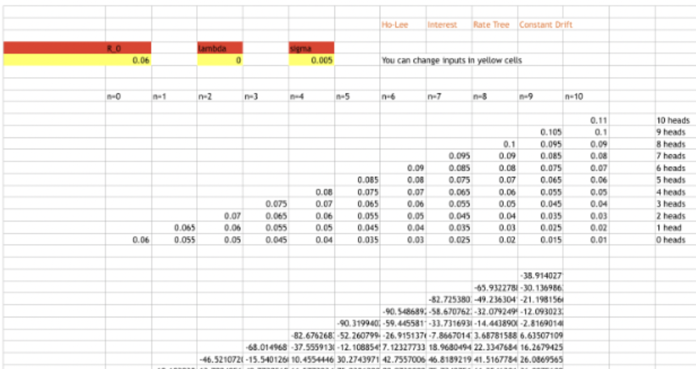
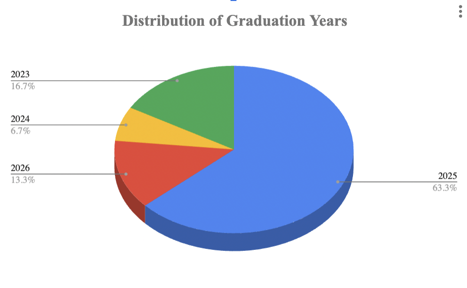
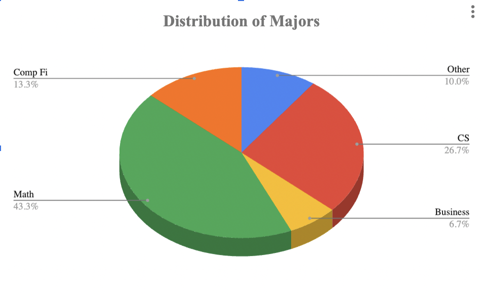
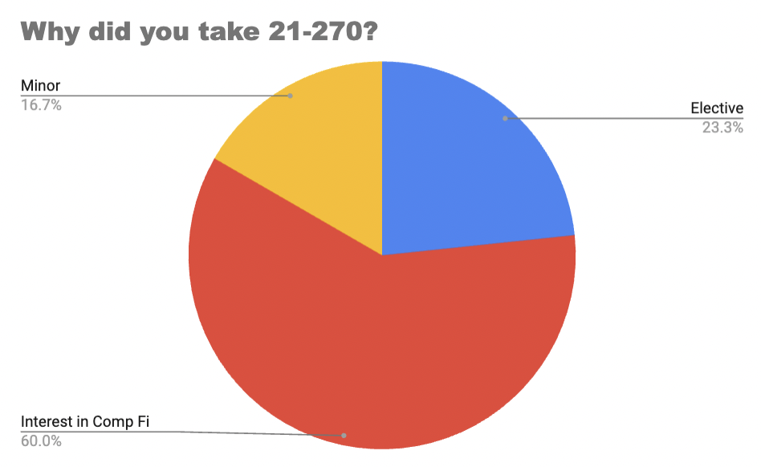
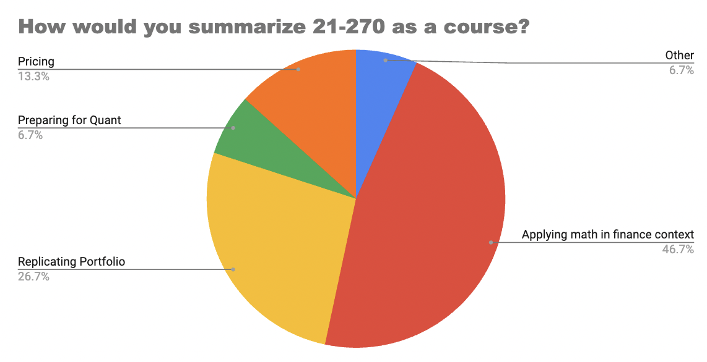
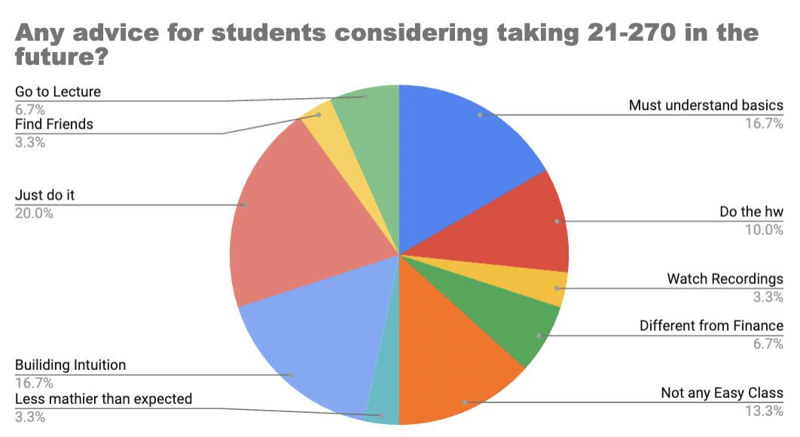

# A Ramble about the Undergraduate Computational Finance Courses at CMU

Obviously, a lot of people have heard about quant as a career, how it makes a lot of money, and people who are STEM-inclined should definitely try it out. As a CMU student, you probably heard of **21-270: Introduction to Mathematical Finance**. It introduces you to the ideas of quant finance, it satisfies as an elective for a lot of math concentrations, and is the stepping stone if you want to major or minor in computational finance. 

Honestly, I had no idea what the course was about until I took it. The only things I knew about it was that there was a 3 digit waitlist for the course. Since it was offered again in the summer, a lot of my friends took it during the spring, so i decided to take it as well. Since the course descriptions are kind of outdated, I'm just here to ramble a bit about what the courses are like so y'all get an idea of whether to take them.

## What is Computational Finance about?

The short answer? Math in an applied context. It basically takes the ideas you learnt in probability courses, linear algebra courses, differential equations courses etc., and then apply them on a different context entirely. As you approach more advanced computational finance courses, it starts to go more in depth using stochastic calculus and some measure theory. Hence, it is a subject highly focused on precise calculations and proofs.

The main topic of computational finance is pricing. Let's say that you have designed a game where you flip 2 coins. If the user gets 2 heads, they get paid 100 dollars. If they get 1 head, they get paid 80 dollars. Otherwise, they get nothing. How much should you charge them such that the game is fair? Obviously, we could just take the expected value. But what if the coin is biased? Let's say it's a 10% chance to get a head instead. Some people are willing to take the risk and some people aren't. However, we are still able to compute a fair price that doesn't care about risk preferences! As we create more and more complicated payouts, we will require more math to calculate such prices.

## What are the Computational Finance courses at CMU NOT about?

Honestly, it has little relation to actual finance (ok I guess you do price securities which is financey, but you know what I mean). You do not need to know anything about economics, how finance works in the real world, accounting, or anything businessy. It will not teach you trading or portfolio management. Hence, if that is the only reason you considered taking this course, I would highly reccomend other courses offered by Tepper.

## So what are the courses like?

Excellent question! That is what I'm about to ramble about next!

### 21-270: Introduction to Mathematical Finance

Prerequisite: Calc 1

The course is split into mainly 2 halves. For the first half, you learn about call and put options, some basic securities including annuities and coupon bonds, and then the main idea that gets drilled is that pricing = replication.

Here's kind of an idea of what it looks like: Let's say there is a bank with a 20% annual interest rate. In other words, if I invest 100 dollars in the bank today, I will have 120 dollars in a year. A stock is also being sold for 200 dollars today. You can basically think of a stock as an object whose value changes every year.

You and your friend Jerick agree on a trade. You will pay Jerick 2 stocks in 1 year and 3 stocks in 2 years. In return, Jerick will pay you $K$ dollars in 3 years. How much should $K$ be such that neither is 'exploiting the other'?

In order to solve such a problem, we use the concept of replication. Basically, what can we do right now such that we have what we need to pay at the later times? So Jerick needs to pay $K$ dollars in 3 years. That means that if Jerick invests $K/1.2$ dollars in the bank in 2 years, it will grow to $K$ dollars in 3 years. Hence, Jerick just invests $K/1.2^3$ right now, and he will have $K$ dollars to pay you in 3 years.

On the other hand, you could just buy 5 stocks right now and hold them. In 1 year, you just give 2 of your stocks to Jerick, and in 2 years, you just give him your remaining stocks. This will cost 
$50\cdot 5=250$.

Equating them together, you have that 
$K/1.2^3=250 \implies K=432$

As the course goes on, you get introduced to more complicated securities, but the main idea is the same: Your goal is to find a way to replicate what would happen in the future based on prices today.

For the second half of the course, you get introduced to risk-neutral probabilities, where basically, you obtain the formula: 
$V_0=\frac{1}{1+r}\tilde{E}[V_1]$, where $r$ is the interest rate, $V_n$ is the price of the security at time $n$. In plain English, it just means that the time-0 price of a security should just be the average payout discounted back, which kind of makes sense intuitively. The course then also introduces the fundamental theorem of asset pricing, which basically relates arbitrage and risk-neutral measures.

But as you can see, the course focuses a lot more on pricing rather than financey topics.

### 21-370: Discrete Time Finance

Prerequisite: 21-270 and Calc 3

Co-requisite: Probability

So, remember how in 21-270 you managed to prices securities in a 1-period model? 21-370 basically extends that to multiple periods.

In 270, it has been proved that the value of a portfolio changes by
$X_1=\Delta S_1+(X_0-\Delta S_0)(1+r)$ where $\Delta$ is some trading strategy. It has also been shown that we can calculate $\tilde{p}=\frac{1+r-d}{u-d}$ and $\tilde{q}=1-\tilde{p}$ for the risk neutral probabilities given $u$ and $d$. 

In 370, the exact same concept occurs! In order to find the price of a security, we replicate it using a portfolio and determine its price. If we have that $V_n=\frac{1}{1+r}\tilde{E_n}[V_{n+1}]$, surely we have that 
$V_0=\frac{1}{(1+r)^N}\tilde{E}[V_N]$ (the subsript above is just to denote conditional expectation at time $n$, it's fine if you don't understand it).

Hence, if we know the payout at time 4, we can calculate the different possible prices at time 3, and so on, and slowly calculate it back to time 0 as our final result. This is called backwards induction.

We then realize that this requires a lot of computation, and wonder if there is a better method to solve it.

 Hence, the course then goes into conditional expectation and some very intro measure theory, just so those concepts can be used later. You will then learn about martingales, which is basically a process whose expected value stays constant over time. Here, we have random variables which are different over time, which is kind of new to most people, since it is does bring in some stochastic calculus.

Martingales have the neat property in which $E[M_n]=M_0$. Hence, our idea is that we can "match" our current security with a martingale, and using some calculation, things simplify a lot.

The second half of the courses then goes into more applications, including american options, optimal exercise strategies, infinite time horizons, optimal investments, and ends with an introduction to the black-sholes model. In order to calculate the time-0 values, it's basically just manipulations with probability and expected value.

An example homework problem might be given that $X_n$ is a random walk that moves up with probability $0.5$, find a function $f$ such that $f(X_n)$ is a martingale. So yes, it will not be like 270 where you simply calculate stuff using algebra: You actually need to use mathematical concepts to prove things.

### 21-378: Mathematics of Fixed Income Markets
Prequisite: 21-270
Co-requisite: 21-370, 21-325

Aight, so this will be a lot similar to 270 than 370. Basically, we go back to pricing securities, but this time, we will price securities that actually exist in the real world and then use some algebra and mathematical intuition to price them.

The course starts off with a review of interest rates, forward rates, discount factors etc. It then introduces different bonds as well as floaters (a LOT of replication can be done with floaters), as well as different yield curves. It then talks about one-factor sensitivity including DV01, duration, and convexity, which then leads to multi-factor hedging, which requires some PCA analysis. Basically, we are trying to determine how much prices change based off of how much the interest rate might change, and then develop hedging strategies based off of those ideas.

The second half of the course then goes into binomial short rate models, which is kind of similar to 370 in the case that we have to use backwards induction to actually calculate the initial price. However, in this course, you will use excel sheets to calculate the prices. This is done using state representation. Basically, every time period we flip a coin, and based off of the time period and the number of heads seen so far, a model gives the interest rate at that time. Hence, by knowing the payouts, we can use backwards induction to calculate the time 0 price. The homework may look something like this:

Hence, using these techniques, we can price even more complicated securities including american options, early exercises, swaps, swaptions, puttable and callable bonds, forwards and futures, as well as mortage-back securities. 

Basically, it's a lot of mathematical intuition brought by 21-270 as well as a lot of calculations and manipulations with spreadsheets.

### 21-420: Continuous Time Finance

Prerequisite: 21-370, Diff Eq, Probability

Honestly, 420 just dives into a completely different chapter. It starts off by talking about law of large numbers and central limit theorem (which are used in a lot of proofs later). It then jumps into stochasic processes including brownian motion, which is basically a process that looks like so:

We then realize that conditional expectation kind of changes since we are working in a continuous time horizon, but some things stay the same. In particular, brownian motion is a martingale. We can then define stochastic integrals using brownian motion. After learning some concepts about quadratic variation, you then learn ito's formula and its applications.

Later, you actually go back to learning about pricing and stuff. We first model stock price as a geometric brownian motion:
$dS_t=\alpha S_t\, dt+\sigma S_tdW_t$, which basically says that the change in stock price changes by some $\alpha$ over time, as well as some random volatility defined by $dW_t$ scaled by $\sigma$. We also reform the self-financing formula to be:
$dX_t=\Delta_t dS_t+r(X_t-\Delta_t S_t) dt$
where we can derive the black-scholes PDE.

For the second half of the course, we delve into multi-dimensional ito calculus, so we can have portfolios with different stocks. We also have to derive new risk neutral measures, since our old risk neutral measure with the $\tilde{p}=\frac{1+r-d}{u-d}$ doesn't work for our use. However, the main idea is still the same:
$V_t=\frac{1}{D_t}\tilde{E}_t(D_TV_T)$, looks similar to what we started with right?

The course then ends with a muldimentional-market, where basically, we can have stocks dependent on more than 1 brownian motion, and concludes with an updated fundamental theorem of asset pricing.

An example homework problem would be something like finding the PDE for a security that pays $g(S_T^1,S_T^2)$ and time $T$ where each stock is modeled by $$dS_t^i=\alpha_iS_t^i\, dt+\sum_{j=1}^2\sigma_{i,j}S_t^idW_t^j$$ where $W$ is a 2 dimensional brownian motion. There will be problems relating to stochastic calculus, as well as a few pricing problems which still relate to a lot of math.

## But aren't you a biased source?

Excellent question by that statistician back there! Therefore, I surveyed 30 other students about the same matter from the following distribution (thanks for all of your help!!):

And here are their responses:

Which I believe kind of matches what I talked about earlier, so hopefully I wasn't too biased!

Now I know some of y'all are curious about the other courses, buuuut only a small subset of the group above actually took them, so here are the responses:

**How would you describe the content in 21-370?**
- Backwards Induction
- Probability Theory
- Mathy
- Transition to 21-420

**How would you describe the content in 21-378?**
- Analyzing Fixed Income Securities
- Spreadsheet Calculations
- 21-270 on Steroids
- Transition to 21-420
- Analyzing Market
- Interesting Concepts

**How would you describe the content in 21-420?**
- A whole bunch of advanced math
- Actual useful stuff in the quant world

**Any advice for anyone planning to take any of the more advanced comp fi couses?**

And that's it for my ramble about the computational finance courses at CMU! Feel free to email me at junkais@andrew.cmu.edu if you have any other questions!!!

